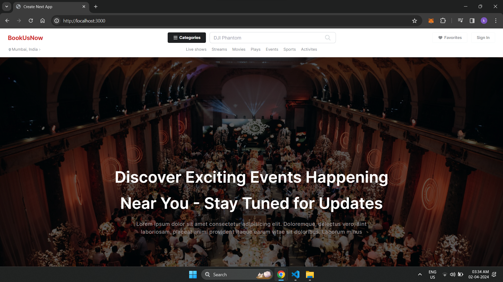
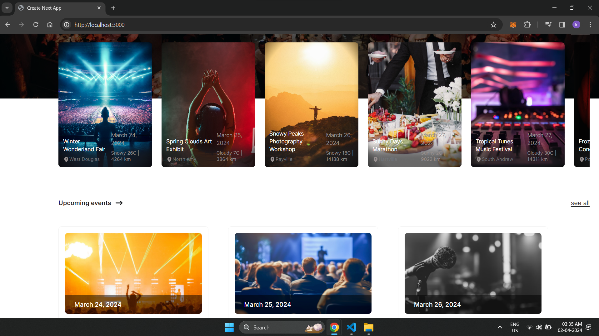
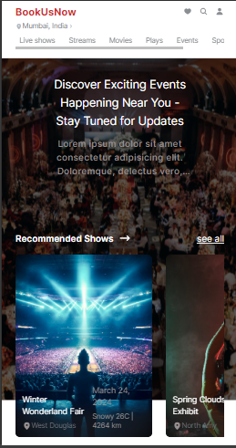
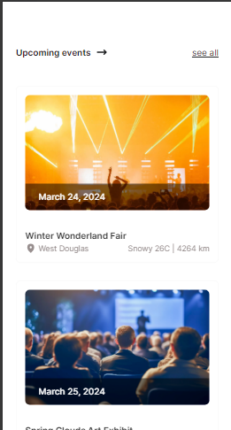

## Project overview.
### screenshots
#### Web View



#### Mobile View




## Prerequisites


Make sure you have Node.js and npm (or yarn) installed on your machine.

## Step 1: Clone the Next.js App Repository
Clone the repository of your Next.js application from your version control system (e.g., GitHub).

```bash
git clone https://github.com/iam-sphinx/Gyan-Groove-Assignment.git
cd Gyan-Groove-Assignment
```

## Step 2: Install Dependencies
Install the required dependencies for the Next.js app using npm or yarn.

```bash
npm install

```

## Step 3: Start the Development Server
Start the Next.js development server. This will compile your code, set up hot reloading, and make your app available at a local URL.

```bash
npm run dev
```

## Step 4: Access Your App
Once the server is up and running, you can access your Next.js app by opening a web browser and navigating to [http://localhost:3000](http://localhost:3000).

## Additional Steps
- If your Next.js app requires environment variables, make sure to set them up before starting the development server.
- Check the project's README file or documentation for any additional steps specific to your Next.js application.

That's it! You've successfully started your Next.js app locally. Happy coding!

## Explanation of design and technical decisions.

# Project Title: Next.js Frontend with Tailwind CSS, Moment.js, React Query, and Heroicons

## Description

This project is a simple frontend web application built using Next.js, a React framework. It incorporates Tailwind CSS for styling, offering a utility-first approach to rapidly build custom designs. Moment.js is utilized for date formatting, enabling seamless manipulation and display of dates and times within the application. React Query is integrated for efficient data fetching and caching, enhancing the performance of API calls. Additionally, Heroicons are employed for easy inclusion of SVG icons, providing a variety of readily available icons to enhance the user interface.

The combination of these technologies allows for the creation of a responsive and visually appealing web application with optimized data handling and user experience.

